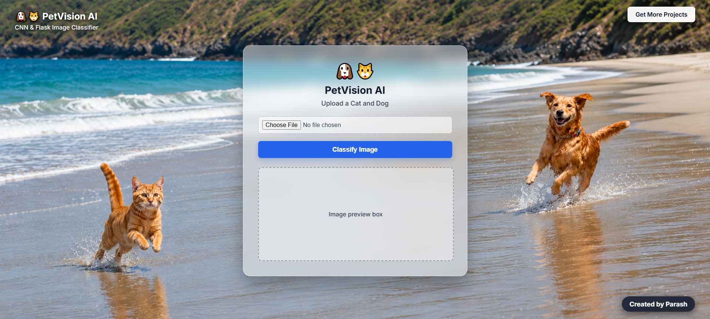
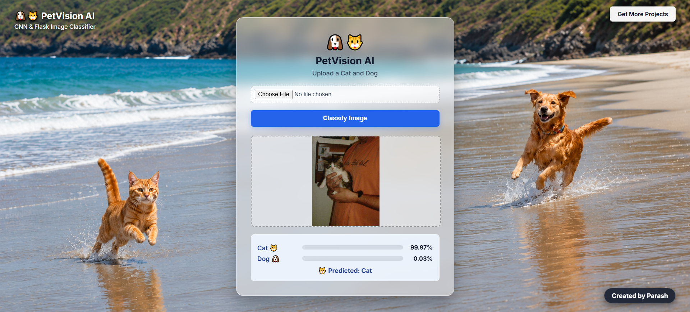

# 🐱🐶 Cat & Dog Image Classification using CNN

A Deep Learning web application that classifies uploaded images as **Cat** or **Dog** using a Convolutional Neural Network (CNN).

The trained CNN model is integrated with a **Flask web application**, allowing users to upload an image and receive a prediction with confidence scores.

---

PetVision AI — Image Interface
---


---

## Project Overview

This project demonstrates an end-to-end Deep Learning workflow:

- Dataset preparation
- Image preprocessing
- CNN model development
- Model training and validation
- Model evaluation
- Model saving
- Flask web application integration
- Image upload and prediction
- Prediction confidence display

The model accepts images resized to **150 × 150 pixels** and normalizes pixel values to the range **0–1** before prediction.

---

## Features

- Cat vs Dog image classification
- Custom CNN architecture
- Image upload through web interface
- Prediction confidence
- Real-time prediction using Flask
- Input image preprocessing
- Low-confidence image rejection
- Saved `.h5` trained model
- Simple browser-based interface

---

## CNN Model Architecture

The model uses a Sequential CNN architecture:

```text
Input Image
   │
   ▼
150 × 150 × 3
   │
   ▼
Conv2D - 32 Filters
   │
   ▼
MaxPooling2D
   │
   ▼
Conv2D - 64 Filters
   │
   ▼
MaxPooling2D
   │
   ▼
Conv2D - 128 Filters
   │
   ▼
MaxPooling2D
   │
   ▼
Flatten
   │
   ▼
Dense - 512 Neurons
   │
   ▼
Dropout - 0.5
   │
   ▼
Dense - 1 Neuron
   │
   ▼
Sigmoid
   │
   ▼
Cat / Dog

```
---

PetVision AI — Classification Result

---



---

## Installation & Setup

Follow the steps below to run the project locally.

### Prerequisites

Before installing the project, make sure you have:

- Python 3.13 (64-bit)
- Git
- pip
- A code editor such as VS Code

> **Important:** For this project, Python **3.13 (64-bit)** is recommended.
>
> TensorFlow currently provides supported packages for Python **3.10–3.13**. Python **3.14 is not currently listed as a supported version** by TensorFlow.

Follow these steps to run the project locally:
```
# 1. Clone the repository
git clone https://github.com/YOUR_USERNAME/CNN-Cat-and-Dog-Classification.git

# 2. Open the project folder
cd CNN-Cat-and-Dog-Classification

# 3. Create a Python 3.13 virtual environment
py -3.13 -m venv venv

# 4. Activate the virtual environment
venv\Scripts\activate

# 5. Upgrade pip
python -m pip install --upgrade pip

# 6. Install project dependencies
pip install -r requirements.txt

# 7. Start the Flask application
python app.py
```
